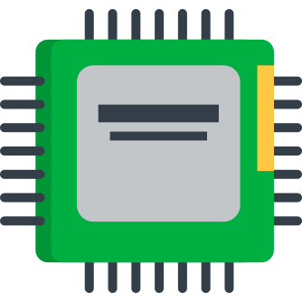
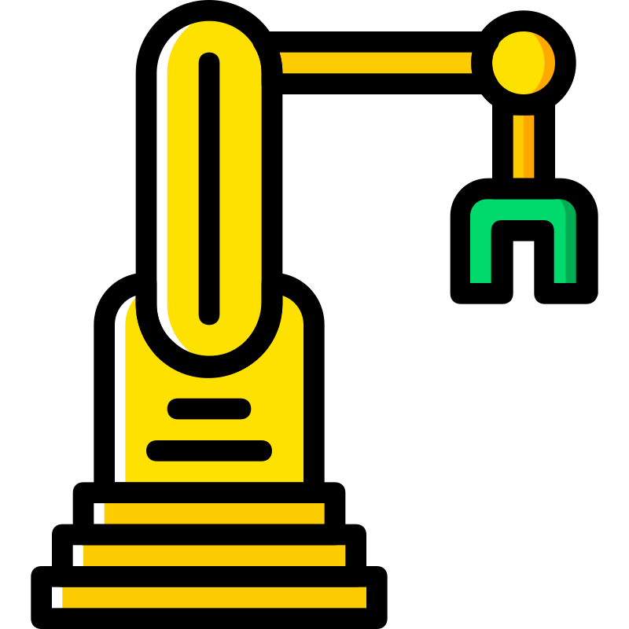
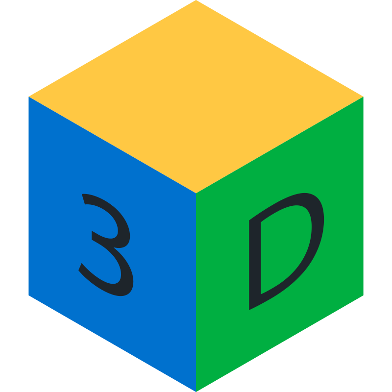
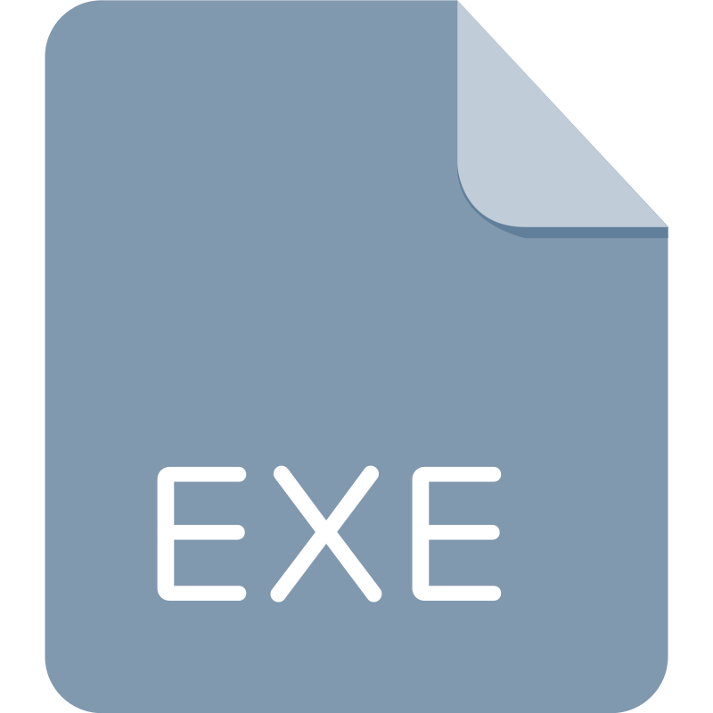

##  &nbsp;Tech Stacks

 ####  &nbsp;Programming Languages

&nbsp;
&nbsp;
&nbsp;
&nbsp;
 ####  &nbsp;Embedded & Hardware

&nbsp;
&nbsp;

 ####  &nbsp;Industrial Automation & Robotics

&nbsp;
&nbsp;

###  &nbsp;3D Modeling & Printing

&nbsp;
&nbsp;
&nbsp;

###  &nbsp;Programs

&nbsp;
&nbsp;
&nbsp;
&nbsp;
&nbsp;
&nbsp;
&nbsp;

